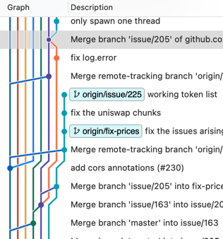

# hf-presentation

Presenting hubflow to the team

current git tree preview: 



## How grownups do the stuff

Setup: `git hf init` - done.

### Working on some feature

```shell
npm init
git hf feature start awesome-feature
```

- do work -> update Changelog
- create PR -> develop (https://github.com/DZariusz/hf-presentation)
- add more commits:
  - amend
  - squash them locally

```shell
git hf feature finish [awesome-feature]
```

### Making release

```shell
git hf release start 0.1.0
git hf release finish 0.1.0
```

### Making hotfix

```shell
git hf hotfix start 0.1.1
git hf hotfix finih 0.1.1
```

